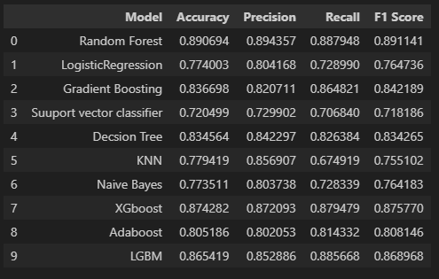
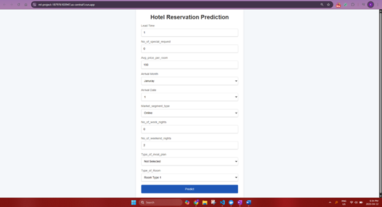
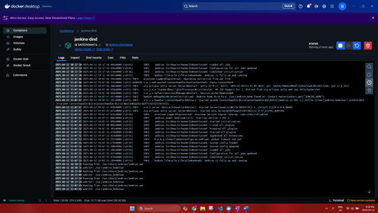

# 🏨 Hotel Reservation Prediction

This project aims to predict whether a hotel booking will be canceled based on various customer and reservation-related features. By leveraging machine learning techniques and modern deployment practices, the solution enables proactive management of hotel reservations to improve operational efficiency.

---

## 🔍 Problem Statement

Hotel booking cancellations lead to significant revenue losses and poor resource planning. This project helps hotels **predict the likelihood of a booking being canceled** based on customer behavior, booking patterns, and preferences.

---

## 📊 Features Used

### Categorical Columns
- `type_of_meal_plan`
- `required_car_parking_space`
- `room_type_reserved`

### Numerical Columns
- `no_of_adults`
- `no_of_children`
- `no_of_weekend_nights`
- `no_of_week_nights`
- `lead_time`
- `arrival_date`
- `avg_price_per_room`
- `no_of_special_requests`

---

## 🧠 ML Workflow

### 1. **Data Infrastructure Setup**
- Data stored and maintained in a **Google Cloud Storage (GCP Bucket)**.

### 2. **Development Environment**
- Codebase built using **VS Code** with Python.
- Versioning via **GitHub**.

### 3. **Data Ingestion**
- Data pulled directly from GCP Bucket into local development environment.

### 4. **Exploratory Data Analysis (EDA) & Preprocessing**
- **Univariate & Bivariate Analysis** to explore data trends.
- **Label Encoding** for categorical features.
- **Variance Inflation Factor (VIF)** to detect multicollinearity.
- Handling **skewness**, **imbalanced datasets**.
- **Feature selection** using RandomForest importance scores.

### 5. **Model Selection**
Models compared based on key metrics:
- ✅ Accuracy  
- 📌 Precision  
- 🔁 Recall  
- 🎯 F1 Score

**Models Tested**:
- Random Forest (RF)
- Gradient Boosting
- AdaBoost
- Logistic Regression
- Support Vector Classifier (SVC)
- K-Nearest Neighbors (KNN)
- Gaussian Naive Bayes (NB)
- LightGBM (LGBM)
- XGBoost (XGB)

  

✅ **Best Model**: `Random Forest Classifier`

### 6. **Hyperparameter Tuning**
- Using **RandomizedSearchCV** to optimize:
  - `bootstrap`
  - `max_depth`
  - `min_samples_leaf`
  - `min_samples_split`
  - `n_estimators`

### 7. **Model Training & Saving**
- Final model trained and serialized using `joblib`.

### 8. **Experiment Tracking**
- Integrated **MLFlow** for tracking experiments, metrics, and models.

### 9. **Pipeline Development**
- Modular **training pipeline** created for scalability and reusability.

### 10. **Version Control**
- **Code Versioning**: Git + GitHub  
- **Data Versioning**: GitHub + GCP bucket logging

---

## 🌐 User Interface

### Flask Application
- Built using Flask to interact with the trained model.
- Accepts user input and predicts if the booking will be canceled.

  

---

## 🚀 CI/CD Deployment

### Containerization & Deployment Workflow:
1. **Create virtual environment** using Jenkins pipeline.
   
   
   
3. **Dockerize** the project.
   
5. **Build Docker image** and push to **Google Cloud Container Registry (GCR)**.
   
7. **Deploy image** to **Google Cloud Run** for seamless scalability.

   
   

---

## 🛠️ Tech Stack

- **Python** 🐍  
- **Scikit-learn**, **Pandas**, **NumPy**, **Matplotlib**, **Seaborn**  
- **MLFlow** for experiment tracking  
- **Flask** for UI/API  
- **Docker**, **Jenkins** for CI/CD  
- **Google Cloud Platform** (GCS, GCR, Cloud Run)  

---

## 📦 Dataset

The dataset used for this project can be accessed [here](https://www.kaggle.com/datasets/ahsan81/hotel-reservations-classification-dataset) on Kaggle.

---

## 🙏 Acknowledgements

This project is part of a course taught by **Sudhanshu Gusain** on **udemy.com**.  
Thanks to the instructor for a practical, hands-on approach to solving real-world ML problems!

---

